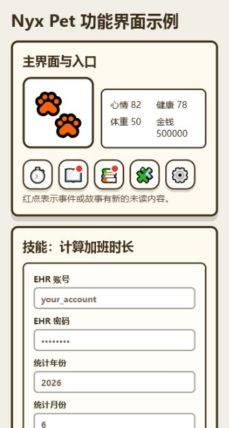

# Nyx Pet 使用说明

Nyx Pet 是一个 Windows 便携桌宠。它会悬浮在桌面上，支持互动、生活事件、连续故事、技能脚本和换皮肤。透明空白区域会穿透鼠标，不会挡住后面的窗口；需要移动时，按住宠物本体拖动即可。



## 快速开始

1. 解压 `NyxPet-Portable.zip`。
2. 双击 `Nyx Pet.exe` 启动。
3. 点击宠物打开菜单。
4. 通过菜单进入技能、事件、故事、互动和设置。

第一次运行后，程序会在 exe 同级生成 `data\` 目录，用来保存宠物状态、账本、事件记录、技能输入等数据。想恢复默认状态时，退出程序后删除 `data\` 即可。

## 技能

技能用于运行外部脚本。当前便携版自带一个常用技能：`计算加班时长`。

入口：

```text
点击宠物 -> 技能 -> 计算加班时长
```

第一次运行时会要求输入：

- `EHR 账号`
- `EHR 密码`
- `统计年份`
- `统计月份`

点击运行后，桌宠会调用：

```text
skills\overtime_calculator.py
```

脚本输出会显示在宠物气泡里。长文本会变成可滚动气泡。

### 保存账号和月份

为了减少重复输入，技能会把输入保存到：

```text
data\skill-inputs.json
```

下次运行时：

- 账号、年份、月份会自动带出。
- 密码框可以留空，程序会沿用上次保存的密码。
- 如果要换月份，可以在弹窗里改，也可以直接修改 `data\skill-inputs.json` 中的 `query_mon`。

注意：`data\skill-inputs.json` 可能包含账号和密码缓存，不要把运行过的 `data\` 目录发给别人。

### 扩展新技能

把 Python 脚本放到 exe 同级的 `skills\` 目录，然后修改：

```text
skills\skills.json
```

示例：

```json
{
  "id": "my_skill",
  "name": "我的技能",
  "icon": "✨",
  "command": "python",
  "args": ["my_skill.py"],
  "timeoutSeconds": 30,
  "outputLimit": 3000
}
```

如果需要运行前输入参数，可以在配置里增加 `prompts`。修改 `skills.json` 后，程序会尝试自动刷新技能菜单；如果没有立刻出现，重启 `Nyx Pet.exe`。

## 互动

互动是宠物玩法的主要入口。点击宠物后进入 `互动`，可以选择工作、吃饭、锻炼、羽毛球、掼蛋、自助餐等活动。

互动会带来几类变化：

- 改变宠物状态：心情、健康、体重、发量、金钱。
- 产生账本记录：例如吃饭、场地费、买球、夜宵等。
- 触发事件：例如羽毛球可能触发“需要买球了”。
- 推进故事：例如掼蛋可能进入“掼蛋冲级线”或“阿杜掼蛋局”。

部分互动有后续事件。比如：

- 打羽毛球触发“需要买球了”后，可能后续触发“新球手感不错”。
- 掼蛋触发“三冲 A 未果”后，可能后续触发“排队复仇”或“泡茶冷静”。
- 点两次自助餐后，`饮食小剧场` 会按最近触发排序出现在故事列表上方。

## 事件

事件记录所有已经发生的生活小事，包括日常事件、互动事件和后续事件。

入口：

```text
点击宠物 -> 事件
```

事件会显示：

- 日期
- 事件名称
- 所属故事或类别
- 金钱、心情、健康变化

当有新事件发生时，`事件` 按钮会显示红点。点开读过后红点消失。

## 故事

故事会把相关事件整理成连续故事线。它不是单条记录，而是一组有上下文的生活片段。

入口：

```text
点击宠物 -> 故事
```

故事支持：

- 最近触发优先排序。
- 分类筛选，例如 `掼蛋`、`羽毛球`、`饮食`、`工作`。
- 点击故事展开时间线。
- 查看最近事件、后续可能发生什么。

示例故事线：

- `掼蛋冲级线`：冲 A、被打回 2、复仇、终于升级。
- `阿杜掼蛋局`：和阿杜搭档、阿杜救场、阿杜调侃、语音复盘。
- `羽毛球补给线`：买球、换拍线、买手胶、场地费。
- `饮食小剧场`：自助餐吃撑、第二天清淡点、发现新店。

当有新故事进展时，`故事` 按钮会出现红点。打开故事后红点消失。

## 换皮肤

桌宠支持换皮肤，当前便携版自带多套皮肤。

入口：

```text
点击宠物 -> 设置 -> 换皮肤
```

皮肤列表会显示宠物自己的名字，点击即可切换。当前选中的皮肤会显示对勾。

皮肤目录在 exe 同级：

```text
pets\
```

每个皮肤是一个独立文件夹，至少包含：

```text
pets\my-pet\
  pet.json
  spritesheet.webp
```

`pet.json` 示例：

```json
{
  "id": "my-pet",
  "displayName": "我的宠物",
  "spritesheetPath": "spritesheet.webp"
}
```

新增皮肤时，把新皮肤文件夹放进 `pets\`，重启 `Nyx Pet.exe` 后就会出现在换肤菜单。

## 数据和隐私

便携版不会在压缩包里预置个人运行数据。第一次启动后才会创建：

```text
data\
  pet-state.json
  events.json
  ledger.json
  pet-settings.json
  skill-inputs.json
```

这些文件记录宠物状态、事件、账本、皮肤设置和技能输入。再次分发给别人前，请删除 `data\` 目录。

## 常见问题

### 为什么透明区域不挡窗口？

Windows 版启用了透明区域鼠标穿透。只有宠物本体、菜单、气泡、状态面板等可见区域会接收点击，空白区域会把点击交给后面的窗口。

### 为什么有红点？

红点表示有未读事件或故事。打开对应页面后红点会消失。

### 技能运行失败怎么办？

先确认电脑安装了 Python，并且命令行里能运行：

```powershell
python --version
```

如果脚本用到第三方依赖，需要先安装。例如：

```powershell
py -m pip install requests
```

### 怎么重置宠物？

退出程序，删除 exe 同级的 `data\` 目录，再重新启动。
